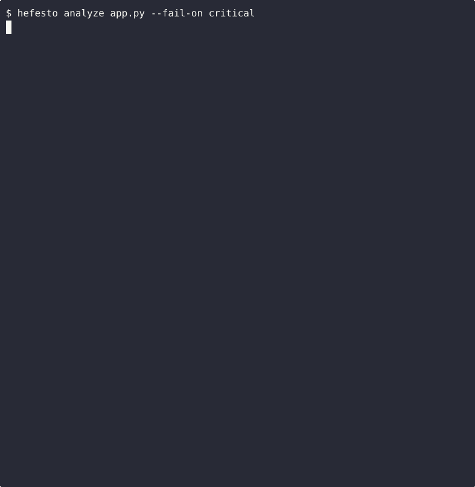

# HefestoAI — release truth engine for AI-generated code

<p align="center">
  
</p>

After your AI wrote the code, but before it ships. HefestoAI verifies that what your project declares — deps, configs, install artifacts — matches what it actually does.

[](https://pypi.org/project/hefesto-ai/)
[](https://www.python.org/downloads/)
[](https://opensource.org/licenses/MIT)
[](https://github.com/artvepa80/Agents-Hefesto)

---

## Operational Truth Analyzers (v4.12.1)

HefestoAI's core contribution: detecting drift between what your project **declares** and what it **does**. These analyzers run automatically on every `hefesto analyze` and catch issues that linters and security scanners miss because they're not in any single file — they're in the inconsistency between files.

| Analyzer | What it catches | Rule ID |
|----------|----------------|---------|
| **Imports vs Deps** | Python imports not declared in `pyproject.toml` or `requirements.txt` | OT-IMPORTS-001 |
| **Docs vs Entrypoints** | CLI scripts in `[project.scripts]` missing from README | OT-DOCS-001 |
| **Packaging Parity** | Version mismatch between `pyproject.toml`, CHANGELOG, and README badges | OT-PKG-001/002 |
| **Install Artifact Parity** | `action.yml` inputs not consumed; `Dockerfile` COPY sources missing | OT-INSTALL-001/002 |
| **CI Config Drift** | Python version or flake8 config mismatch between local and CI workflow | OT-CI-001/002/003 |

```bash
# All operational truth findings appear in standard output
hefesto analyze . --severity MEDIUM
```

---

## Quick Start

```bash
pip install hefesto-ai
cd your-project
hefesto analyze . --fail-on critical

# PR review (new in v4.11.2) — analyze only changed code
hefesto pr-review
hefesto pr-review --strict        # include file-level context
hefesto pr-review --post --pr 42  # post inline comments via gh CLI
```

---

## Why Hefesto? The AI Code Problem

AI tools like Claude Code, GitHub Copilot, and Cursor generate code at machine speed. But **who validates that code?**

- Copilot generates `os.system(user_input)` → **command injection**
- Claude writes `f"SELECT * FROM {table}"` → **SQL injection**
- AI code looks clean to linters but **changes business logic silently** (semantic drift)

**Hefesto catches what your linter misses.** Pre-commit, pre-push, CI/CD — before it reaches production.

---

## What Hefesto Catches

| Issue | Severity | Description |
|-------|----------|-------------|
| HARDCODED_SECRET | CRITICAL | API keys, passwords in code |
| SQL_INJECTION_RISK | HIGH | String concatenation in queries |
| COMMAND_INJECTION | HIGH | Unsafe shell command execution |
| PATH_TRAVERSAL | HIGH | Unsafe file path handling |
| UNSAFE_DESERIALIZATION | HIGH | pickle, yaml.unsafe_load |
| UNDECLARED_DEPENDENCY | MEDIUM | Import used but not in pyproject.toml |
| PACKAGING_VERSION_DRIFT | MEDIUM | Version mismatch across pyproject/CHANGELOG/README |
| CI_CONFIG_DRIFT | MEDIUM-HIGH | Local env vs CI configuration mismatch |
| INSTALL_ARTIFACT_DRIFT | MEDIUM-HIGH | action.yml inputs or Dockerfile COPY out of sync |
| HIGH_COMPLEXITY | HIGH | Cyclomatic complexity > 10 |
| DEEP_NESTING | HIGH | Nesting depth > 4 levels |
| GOD_CLASS | HIGH | Classes > 500 lines |
| LONG_FUNCTION | MEDIUM | Functions > 50 lines |
| LONG_PARAMETER_LIST | MEDIUM | Functions with > 5 parameters |

```python
# Hefesto catches:
password = "admin123"  # HARDCODED_SECRET
query = f"SELECT * FROM users WHERE id={id}"  # SQL_INJECTION_RISK
os.system(f"rm {user_input}")  # COMMAND_INJECTION

# Hefesto suggests:
password = os.getenv("PASSWORD")
cursor.execute("SELECT * FROM users WHERE id=?", (id,))
subprocess.run(["rm", user_input], check=True)
```

---

## GitHub Action

```yaml
steps:
  - uses: actions/checkout@v4
  - name: Run Hefesto Guardian
    uses: artvepa80/Agents-Hefesto@v4.12.1
    with:
      target: '.'
      fail_on: 'CRITICAL'
```

**Inputs**:

| Input | Description | Default |
|-------|-------------|---------|
| `target` | Path to analyze (file or directory) | `.` |
| `fail_on` | Exit with error if issues found at or above this severity level | `CRITICAL` |
| `min_severity` | Minimum severity to report | `LOW` |
| `format` | Output format (`text`, `json`, `html`) | `text` |
| `telemetry` | Opt-in to anonymous telemetry (1=enable) | `0` |

**Outputs**:

| Output | Description |
|--------|-------------|
| `exit_code` | The exit code of the CLI (0=Success, 1=Error, 2=Issues Found) |

---

## AI-Generated Code Guardrails (Pre-commit + MCP)

HefestoAI is a pre-commit guardian for AI-generated code. It detects semantic drift and risky changes before merge.

**Add as an MCP server:**
```bash
npx @smithery/cli@latest mcp add artvepa80/hefestoai
```

**API Endpoints:**

| Endpoint | Protocol | Path |
|----------|----------|------|
| MCP | JSON-RPC 2.0 | `/api/mcp-protocol` |
| REST | HTTP GET/POST | `/api/mcp` |
| OpenAPI | OpenAPI 3.0 | `/api/openapi.json` |
| Q&A | Natural Language | `/api/ask` |
| Changelog | JSON | `/api/changelog.json` |
| FAQ | JSON | `/api/faq.json` |

---

## PR Review (v4.12.1)

Analyze only the code changed in a pull request. Post inline comments on changed lines with deterministic dedup keys so reruns never create duplicate comments.

```bash
# Generate review as JSON (default — no network, no token needed)
hefesto pr-review

# Post inline comments via gh CLI (convenience mode)
hefesto pr-review --post --pr 42 --repo owner/name

# Include file-level context findings (not just changed lines)
hefesto pr-review --strict
```

**How it works:**
1. Parses `git diff` between base and head (auto-detects `origin/main` or `GITHUB_BASE_REF`)
2. Runs the full analyzer suite on touched files only
3. Filters findings to changed lines (default) or full files (`--strict`)
4. Emits JSON with SHA256 dedup keys for each finding

**GitHub Actions workflow templates** are provided under [`examples/github-actions/`](examples/github-actions/):

| Template | Use case | Idempotent? |
|----------|----------|-------------|
| `hefesto-pr-review-simple.yml` | Quick onboarding, small repos | No (reruns duplicate) |
| `hefesto-pr-review-deduped.yml` | Production CI, teams | Yes (jq dedup pipeline) |

See [`examples/github-actions/README.md`](examples/github-actions/README.md) for setup instructions.


---

## Language Support

### Code Languages

| Language | Parser | Status |
|----------|--------|--------|
| Python | Native AST | Full support |
| TypeScript | TreeSitter | Full support |
| JavaScript | TreeSitter | Full support |
| Java | TreeSitter | Full support |
| Go | TreeSitter | Full support |
| Rust | TreeSitter | Full support |
| C# | TreeSitter | Full support |

### DevOps & Configuration

| Format | Analyzer | Rules | Status |
|--------|----------|-------|--------|
| **YAML** | YamlAnalyzer | Generic YAML security | v4.4.0 |
| **Terraform** | TerraformAnalyzer | TfSec-aligned rules | v4.4.0 |
| **Shell** | ShellAnalyzer | ShellCheck-aligned | v4.4.0 |
| **Dockerfile** | DockerfileAnalyzer | Hadolint-aligned | v4.4.0 |
| **SQL** | SqlAnalyzer | SQL Injection prevention | v4.4.0 |
| **PowerShell** | PS001-PS006 | 6 security rules | v4.5.0 |
| **JSON** | J001-J005 | 5 security rules | v4.5.0 |
| **TOML** | T001-T003 | 3 security rules | v4.5.0 |
| **Makefile** | MF001-MF005 | 5 security rules | v4.5.0 |
| **Groovy** | GJ001-GJ005 | 5 security rules | v4.5.0 |
| **COBOL** | CobolGovernanceAnalyzer | COBOL001-COBOL007 | v4.12.0 |

### Cloud Infrastructure

| Format | Analyzer | Focus | Status |
|--------|----------|-------|--------|
| **CloudFormation** | CloudFormationAnalyzer | AWS IaC Security | v4.7.0 |
| **ARM Templates** | ArmAnalyzer | Azure IaC Security | v4.7.0 |
| **Helm Charts** | HelmAnalyzer | Kubernetes Security | v4.7.0 |
| **Serverless** | ServerlessAnalyzer | Serverless Framework | v4.7.0 |

**Total**: 7 code languages + 11 DevOps formats + 4 Cloud formats = **22 supported formats**

---

## Installation

```bash
# FREE tier
pip install hefesto-ai

# TS/JS parsing + symbol metadata (optional)
pip install "hefesto-ai[multilang]"

# PRO tier
pip install hefesto-ai[pro]
export HEFESTO_LICENSE_KEY="your-key"

# OMEGA Guardian
pip install hefesto-ai[omega]
export HEFESTO_LICENSE_KEY="your-key"
```

---

## CLI Reference (v4.12.1)

```bash
# Analyze code
hefesto analyze <path>
hefesto analyze . --severity HIGH
hefesto analyze . --output json

# PR review (v4.11.2)
hefesto pr-review                              # JSON to stdout
hefesto pr-review --base main --head HEAD      # explicit refs
hefesto pr-review --strict                     # file-level findings too
hefesto pr-review --post --pr 42 --repo o/r    # post via gh CLI

# Check status
hefesto status

# Install/update git hook
hefesto install-hooks

# Start API server (PRO)
hefesto serve --port 8000

# Telemetry Management
hefesto telemetry status
hefesto telemetry clear
```

### JSON Output
```bash
hefesto analyze . --output json          # stdout = pure JSON, banners -> stderr
hefesto analyze . --output json 2>/dev/null | jq .  # pipe-safe
```

### Exit Codes

| Code | Meaning |
|------|---------|
| `0`  | Analysis complete (no `--fail-on`, or threshold not breached) |
| `1`  | Gate failure (`--fail-on` threshold breached) or runtime error |

### Gate Examples
```bash
hefesto analyze . --fail-on high         # exit 1 if HIGH+ found
hefesto analyze . --fail-on critical     # exit 1 only if CRITICAL found
hefesto analyze .                        # always exit 0 (report only)
```

---

## Pre-Push Hook

Automatic validation before every `git push`:

```bash
# Install/update hook (copies scripts/git-hooks/pre-push -> .git/hooks/pre-push)
hefesto install-hooks

# Update an existing hook
hefesto install-hooks --force

# Bypass temporarily
SKIP_HEFESTO_HOOKS=1 git push
```

The hook runs two gates:

1. **Security gate** — `hefesto analyze` with `--fail-on CRITICAL --exclude-types VERY_HIGH_COMPLEXITY,LONG_FUNCTION` (blocks security issues, ignores complexity debt)
2. **Fast lint/test gate** — Black, isort, Flake8, and a minimal test suite

> **Note:** Hooks are local to your machine and not committed to git. Run `hefesto install-hooks` after cloning or whenever `scripts/git-hooks/pre-push` is updated.

---

## Features by Tier

| Feature | FREE | PRO ($8/mo) | OMEGA ($19/mo) |
|---------|------|-------------|----------------|
| Static Analysis | Yes | Yes | Yes |
| Security Scanning | Basic | Advanced | Advanced |
| Pre-push Hooks | Yes | Yes | Yes |
| 22 Language Support | Yes | Yes | Yes |
| ML Enhancement | No | Yes | Yes |
| REST API | No | Yes | Yes |
| BigQuery Analytics | No | Yes | Yes |
| IRIS Monitoring | No | No | Yes |
| Production Correlation | No | No | Yes |

- **PRO**: [Start Free Trial](https://hefestoai.narapallc.com/trial) - 14 days, no credit card
- **OMEGA**: [Start Free Trial](https://hefestoai.narapallc.com/trial) - 14 days, no credit card
- **Founding Members**: [40% off forever](https://hefestoai.narapallc.com/founding) (first 25 customers)

### Hefesto PRO Optional Features

Hefesto OSS works standalone. If Hefesto PRO is installed, OSS can optionally enable:
Patch C API hardening for `hefesto serve`, scope gating (first-party by default), TS/JS
symbol discovery, and safe deterministic enrichment (schema-first, masked, bounded).
See [`docs/PRO_OPTIONAL_FEATURES.md`](docs/PRO_OPTIONAL_FEATURES.md).

---

## REST API (PRO)

```bash
# Start server (binds to 127.0.0.1 by default)
hefesto serve --port 8000

# Analyze code
curl -X POST http://localhost:8000/analyze \
  -H "Content-Type: application/json" \
  -H "X-API-Key: $HEFESTO_API_KEY" \
  -d '{"code": "def test(): pass", "severity": "MEDIUM"}'
```

### API Security (v4.8.0)

The API server is **secure by default**:

| Feature | Default | Configure via |
|---------|---------|---------------|
| Host binding | `127.0.0.1` (loopback) | `HEFESTO_API_HOST` |
| CORS | Localhost only | `HEFESTO_CORS_ORIGINS` |
| API docs | **Disabled** (404) | `HEFESTO_EXPOSE_DOCS=true` |
| Auth | Off (no key set) | `HEFESTO_API_KEY` |
| Rate limit | 60 req/min | `HEFESTO_RATE_LIMIT_PER_MINUTE` |
| Path sandbox | `cwd()` | `HEFESTO_WORKSPACE_ROOT` |

```bash
# Production example
export HEFESTO_API_KEY=my-secret-key
export HEFESTO_CORS_ORIGINS=https://app.example.com
export HEFESTO_API_RATE_LIMIT_PER_MINUTE=60
export HEFESTO_EXPOSE_DOCS=false
hefesto serve --host 0.0.0.0 --port 8000
```

### Endpoints

| Endpoint | Method | Description |
|----------|--------|-------------|
| `/analyze` | POST | Analyze code |
| `/health` | GET | Health check (no auth required) |
| `/ping` | GET | Fast health ping (no auth required) |
| `/batch` | POST | Batch analysis |
| `/metrics` | GET | Quality metrics |
| `/history` | GET | Analysis history |
| `/webhook` | POST | GitHub webhook |
| `/stats` | GET | Statistics |
| `/validate` | POST | Validate without storing |

---

## CI/CD Integration

### GitHub Actions — Full Repo Analysis

```yaml
name: Hefesto

on: [push, pull_request]

jobs:
  analyze:
    runs-on: ubuntu-latest
    steps:
      - uses: actions/checkout@v4
      - name: Install Hefesto
        run: pip install hefesto-ai
      - name: Run Analysis
        run: hefesto analyze . --severity HIGH
```

### GitHub Actions — PR Review with Inline Comments (v4.12.1)

```yaml
name: Hefesto PR Review

on:
  pull_request:
    types: [opened, synchronize, reopened]

permissions:
  contents: read
  pull-requests: write

jobs:
  review:
    runs-on: ubuntu-latest
    steps:
      - uses: actions/checkout@v4
        with:
          fetch-depth: 0
      - run: pip install hefesto-ai
      - name: Review changed code
        env:
          GITHUB_BASE_REF: ${{ github.event.pull_request.base.ref }}
          GITHUB_SHA: ${{ github.event.pull_request.head.sha }}
          GH_TOKEN: ${{ secrets.GITHUB_TOKEN }}
        run: hefesto pr-review --post --pr ${{ github.event.pull_request.number }} --repo ${{ github.repository }}
```

> For production use with dedup (no duplicate comments on reruns), see the workflow templates in [`examples/github-actions/`](examples/github-actions/).

### pre-commit Hook

```yaml
# .pre-commit-config.yaml
repos:
  - repo: https://github.com/artvepa80/Agents-Hefesto
    rev: v4.12.1
    hooks:
      - id: hefesto-analyze
```

### GitLab CI

```yaml
hefesto:
  stage: test
  script:
    - pip install hefesto-ai
    - hefesto analyze . --severity HIGH
```

---

## Configuration

### Environment Variables

```bash
# Core
export HEFESTO_LICENSE_KEY="your-key"
export HEFESTO_SEVERITY="MEDIUM"
export HEFESTO_OUTPUT="json"

# API Security (v4.7.0)
export HEFESTO_API_KEY="your-api-key"                # Enable API key auth
export HEFESTO_API_RATE_LIMIT_PER_MINUTE=60           # Enable rate limiting
export HEFESTO_CORS_ORIGINS="https://app.example.com" # Restrict CORS
export HEFESTO_EXPOSE_DOCS=true                       # Enable /docs, /redoc
export HEFESTO_WORKSPACE_ROOT="/srv/code"              # Path sandbox root
export HEFESTO_CACHE_MAX_ITEMS=256                     # Cache size limit
export HEFESTO_CACHE_TTL_SECONDS=300                   # Cache entry TTL
```

### Config File (.hefesto.yaml)

```yaml
severity: HIGH
exclude:
  - tests/
  - node_modules/
  - .venv/

rules:
  complexity:
    max_cyclomatic: 10
    max_cognitive: 15
  security:
    check_secrets: true
    check_injections: true
```

---

## OMEGA Guardian

Production monitoring that correlates code issues with production failures.

### Features

- **IRIS Agent**: Real-time production monitoring
- **Auto-Correlation**: Links code changes to incidents
- **Real-Time Alerts**: Pub/Sub notifications
- **BigQuery Analytics**: Track correlations over time

### Setup

```yaml
# iris_config.yaml
project_id: your-gcp-project
dataset: omega_production
pubsub_topic: hefesto-alerts

alert_rules:
  - name: error_rate_spike
    threshold: 10
  - name: latency_increase
    threshold: 1000
```

```bash
# Run IRIS Agent
python -m hefesto.omega.iris_agent --config iris_config.yaml

# Check status
hefesto omega status
```

---

## IRIS Telemetry Contract (OMEGA)

IRIS labels deployments as GREEN/YELLOW/RED using post-deploy telemetry. The input format is an open contract — any observability stack can produce it:

| Resource | Path | Description |
|----------|------|-------------|
| **Aggregates Contract v1** | [`docs/telemetry/AGGREGATES_CONTRACT.md`](docs/telemetry/AGGREGATES_CONTRACT.md) | Row schema, units, validation checklist |
| **JSONL Validator** | [`scripts/validate_aggregates_jsonl.py`](scripts/validate_aggregates_jsonl.py) | Stdlib-only validator (no deps) |

```bash
# Validate your telemetry file
python scripts/validate_aggregates_jsonl.py aggregates.jsonl

# Feed to IRIS (OMEGA tier)
export IRIS_TELEMETRY_SOURCE=file
export IRIS_TELEMETRY_FILE=aggregates.jsonl
iris label-outcomes --repo org/repo --commit abc123 --env production --window both --json
```

Enterprise collectors (Prometheus, Datadog, CloudWatch) and integration runbooks are available in the PRO distribution.

---

## vs. Competition

| Criterion | Hefesto | Semgrep | CodeRabbit | Qodo | Snyk |
|---|---|---|---|---|---|
| **AI-generated code focus** | ✅ Primary use case | Generic | ✅ Yes | ✅ Yes | Generic |
| **Declared-vs-real drift detection** | ✅ Core feature | ❌ | ❌ | ❌ | ❌ |
| **Operational truth analyzers** | ✅ 5 analyzers | ❌ | ❌ | ❌ | ❌ |
| **Languages supported** | 22 formats | Many | Many | Many | Many |
| **Setup time** | < 5 min, no config | Config-heavy | Cloud signup | Cloud signup | Cloud signup |
| **Where it runs** | Local CLI / GitHub Action / pre-commit / MCP | Local / cloud | Cloud only | Cloud only | Cloud / CLI |
| **Pricing** | Free OSS / $8 Pro / $19 OMEGA | Free OSS / Contact sales | $24/dev/mo | Free Dev / $30/dev/mo | $25/dev/mo\* |

\*Snyk pricing is per product (Code, Open Source, Container, IaC); multi-product subscriptions cost more.

**HefestoAI's niche:** Detecting drift between what AI-generated code **declares** and what it **does**. Traditional tools validate code against language rules. HefestoAI validates code against the project's own declarations — its dependencies, its configs, its install artifacts.

---

## Dogfooding (Honest Account)

We run HefestoAI's strict gate against HefestoAI's own code on every push to main. As of 2026-04-29, the gate is GREEN — but it took us 6 weeks of refactor to get there.

When we initially activated the gate in strict mode, it flagged 12 complexity findings in our own gate-internals code. We considered three responses: silence the findings (rejected — that's exactly the drift we critique), accept the override permanently (rejected — same reason), or refactor at root cause (chosen — took 1 PR, 4 commits, 2 days, plus a declared-vs-real drift discovery in our own positioning doc that we logged for fix).

The full audit and refactor history are tracked internally in our private repo. The override mechanics and reversion criteria are documented; the gate-internals refactor reduced two CRITICAL functions from cyclomatic complexity 33 → 1 and 25 → 6 respectively, all helpers under 10.

---

## Changelog

### v4.11.2 (2026-04-12)
- **Phase 4 — Narrow Semantic Analyzer**: `ATTRIBUTE_NAME_MISMATCH` (typo detection via difflib) and `SILENT_EXCEPTION_SWALLOW` (broad except with trivially silent body)
- **Cross-repo schema contract test**: pins 12-key PR review finding dict between OSS and Pro
- **`code_snippet` in PR review JSON**: field was silently dropped, now included
- **Phase 3.1 — Enrichment rendering**: PR comments render AI enrichment summary when present
- **Upgrade notice**: shows when a newer version is available on PyPI
- **Fix**: `contextlib.suppress(ImportError)` recognized as optional-import guard
- **Fix**: AST `BinOp(Mod)` catches single-char SQL injection FN (Phase 1c debt closed)
- 474 tests (was 430), 0 regressions

### v4.10.0 (2026-04-12)
- **PR Review**: New `hefesto pr-review` command — diff-scoped analysis with inline GitHub PR comments and SHA256 dedup keys. Two workflow templates (simple + deduped) in `examples/github-actions/`
- **Operational Truth Analyzers**: 5 project-level analyzers detect drift between imports/deps, docs/entrypoints, packaging versions, install artifacts, and CI config — all visible via `hefesto analyze`
- **Security Precision (BP-7)**: SQL_INJECTION FP rate 43%→0% (DB-API placeholders no longer flagged), ASSERT_IN_PRODUCTION 31→0 FPs (AST rewrite), PICKLE/BARE_EXCEPT detectors rewritten with exact matching
- **CI Parity Unification**: `check-ci-parity` findings now appear in `hefesto analyze` via adapter; legacy CLI preserved
- 430 tests (was 346), 0 regressions

### v4.9.9 (2026-03-13)
- **Telemetry**: Anonymous usage pings enabled by default (opt-out via `HEFESTO_TELEMETRY=0`)
- First-run notice printed once to stderr
- No code, paths, or PII collected

### v4.9.7 (2026-03-13)
- **Telemetry**: Anonymous usage ping endpoint (CLI opt-in + GitHub Action always-on)

### v4.9.3 (2026-02-24)
- **MCP endpoint** live (JSON-RPC 2.0)
- **AI discoverability** stack complete (llms.txt, agent.json, OpenAPI, FAQ, Changelog)
- **Registered** in official MCP Registry and Smithery

### v4.9.0 (2026-02-14)
- **Boundary**: Public/private repo split — community edition only in public repo.
- **Removed**: Paid modules (api, llm, licensing, omega), paid infra, paid tests.
- **Hardened**: Packaging (packages.find exclude, MANIFEST.in prune, CI guard).

### v4.8.5 (2026-02-13)
- **GitHub Action**: Market-ready Docker-based action (bypassing PyPI).
- **Security**: Deterministic smoke tests with clean/critical fixtures.
- **CLI**: Verified exit code contract (2 = Issues Found).

### v4.7.0 (2026-02-10)
- **Patch C: API Hardening** — `hefesto serve` is secure-by-default (local-first)
- **Security**: API key auth, CORS allowlist, docs toggle, path sandbox

### v4.3.3 (2025-12-26)
- Fix LONG_PARAMETER_LIST: use AST formal_parameters instead of comma counting
- Fix function naming: infer names from variable_declarator for arrow functions

### v4.2.1 (2025-10-31)
- Critical tier hierarchy bugfix
- OMEGA Guardian release

---

## Telemetry

HefestoAI collects anonymous usage data by default to help improve the tool.

**What's sent:** event type, version, OS, Python version, file count, duration, issue count.
**What's NOT sent:** code, file paths, file contents, project names, or any PII.

Disable with:
```bash
export HEFESTO_TELEMETRY=0
```

---

## Contact

- **Enterprise & licensing**: sales@narapallc.com
- **Support & bug reports**: support@narapallc.com
- **General inquiries**: contact@narapallc.com
- **GitHub Issues**: [artvepa80/Agents-Hefesto/issues](https://github.com/artvepa80/Agents-Hefesto/issues)
- **Website**: [hefestoai.narapallc.com](https://hefestoai.narapallc.com)

## License

MIT License for core functionality. PRO and OMEGA features are licensed separately.

---

**HefestoAI — release truth engine for AI-generated code. Verifies declared-vs-real drift before code ships.**

(c) 2026 Narapa LLC, Miami, Florida
