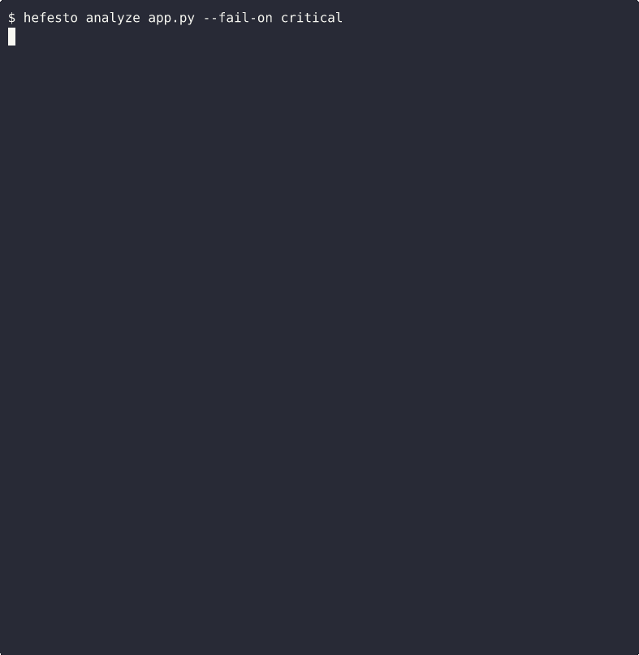

# HefestoAI — release truth engine for AI-generated code

<p align="center">
  
</p>

HefestoAI runs after your AI assistant writes the code and before it ships. It checks that what your project declares (dependencies, configs, install artifacts) matches what it actually does, and it runs security and complexity checks on the code itself.

[](https://pypi.org/project/hefesto-ai/)
[](https://www.python.org/downloads/)
[](LICENSE)
[](https://github.com/artvepa80/Agents-Hefesto)

---

## Operational Truth Analyzers (v4.14.1)

These analyzers look for drift between what your project **declares** and what it **does**. They run on every `hefesto analyze`. The problems they look for don't live in any single file, so a per-file linter or security scanner won't report them: they show up only when you compare two files.

| Analyzer | What it catches | Rule ID |
|----------|----------------|---------|
| **Imports vs Deps** | Python imports not declared in `pyproject.toml` or `requirements.txt` | OT-IMPORTS-001 |
| **Docs vs Entrypoints** | CLI scripts in `[project.scripts]` missing from README | OT-DOCS-001 |
| **Packaging Parity** | Version mismatch between `pyproject.toml`, CHANGELOG, and README badges | OT-PKG-001/002 |
| **Install Artifact Parity** | `action.yml` inputs not consumed; `Dockerfile` COPY sources missing | OT-INSTALL-001/002 |
| **CI Config Drift** | Python version or flake8 config mismatch between local and CI workflow | OT-CI-001/002/003 |

```bash
# All operational truth findings appear in standard output
hefesto analyze . --severity MEDIUM
```

---

## Quick Start

```bash
pip install hefesto-ai
cd your-project
hefesto analyze . --fail-on critical

# PR review (added in v4.10.0) — analyze only changed code
hefesto pr-review
hefesto pr-review --strict        # include file-level context
hefesto pr-review --post --pr 42  # post inline comments via gh CLI
```

---

## Why Hefesto? The AI Code Problem

Assistants such as Claude Code, GitHub Copilot and Cursor write code faster than anyone can review it line by line. Some of what they write passes a linter and is still dangerous:

- `os.system(user_input)` → **command injection**
- `f"SELECT * FROM {table}"` → **SQL injection**
- code that runs but quietly changes behavior, such as a misspelled attribute or an exception that is caught and dropped (checked in Python)

Hefesto checks for these at pre-commit, at pre-push and in CI, so they surface before the code reaches production.

---

## What Hefesto Catches

| Issue | Severity | Description |
|-------|----------|-------------|
| HARDCODED_SECRET | CRITICAL | API keys, passwords in code |
| SQL_INJECTION_RISK | HIGH | String concatenation in queries |
| COMMAND_INJECTION | HIGH | Unsafe shell command execution |
| PATH_TRAVERSAL | HIGH | Unsafe file path handling |
| UNSAFE_DESERIALIZATION | HIGH | pickle, yaml.unsafe_load |
| UNDECLARED_DEPENDENCY | MEDIUM | Import used but not in pyproject.toml |
| PACKAGING_VERSION_DRIFT | MEDIUM | Version mismatch across pyproject/CHANGELOG/README |
| CI_CONFIG_DRIFT | MEDIUM-HIGH | Local env vs CI configuration mismatch |
| INSTALL_ARTIFACT_DRIFT | MEDIUM-HIGH | action.yml inputs or Dockerfile COPY out of sync |
| HIGH_COMPLEXITY | HIGH | Cyclomatic complexity > 10 |
| DEEP_NESTING | HIGH | Nesting depth > 4 levels |
| GOD_CLASS | HIGH | Classes > 500 lines |
| LONG_FUNCTION | MEDIUM | Functions > 50 lines |
| LONG_PARAMETER_LIST | MEDIUM | Functions with > 5 parameters |

```python
# Hefesto catches:
password = "admin123"  # HARDCODED_SECRET
query = f"SELECT * FROM users WHERE id={id}"  # SQL_INJECTION_RISK
os.system(f"rm {user_input}")  # COMMAND_INJECTION

# Hefesto suggests:
password = os.getenv("PASSWORD")
cursor.execute("SELECT * FROM users WHERE id=?", (id,))
subprocess.run(["rm", user_input], check=True)
```

---

## GitHub Action

```yaml
steps:
  - uses: actions/checkout@v4
  - name: Run Hefesto Guardian
    uses: artvepa80/Agents-Hefesto@v4.14.1
    with:
      target: '.'
      fail_on: 'CRITICAL'
```

**Inputs**:

| Input | Description | Default |
|-------|-------------|---------|
| `target` | Path to analyze (file or directory) | `.` |
| `fail_on` | Exit with error if issues found at or above this severity level | `CRITICAL` |
| `min_severity` | Minimum severity to report (`CRITICAL`, `HIGH`, `MEDIUM`, `LOW`) | `LOW` |
| `format` | Output format (`text`, `json`, `html`) | `text` |
| `telemetry` | Opt-in. Only `1` or `true` enables telemetry: the Action sends one anonymous ping per run and the CLI's anonymous ping is turned on. Any other value, including the default `0`, sends nothing; see [Telemetry](#telemetry) | `0` |

**Outputs**:

| Output | Description |
|--------|-------------|
| `exit_code` | The exit code of the CLI (0 = threshold not breached, 1 = `fail_on` threshold breached or runtime error; see [Exit Codes](#exit-codes)) |

---

## AI-Generated Code Guardrails (Pre-commit + MCP)

HefestoAI can run as a pre-commit check or be called by an AI agent over MCP, so risky changes are flagged before merge.

**Add as an MCP server:**
```bash
npx @smithery/cli@latest mcp add artvepa80/hefestoai
```

**API Endpoints:**

| Endpoint | Protocol | Path |
|----------|----------|------|
| MCP | JSON-RPC 2.0 | `/api/mcp-protocol` |
| REST | HTTP GET/POST | `/api/mcp` |
| OpenAPI | OpenAPI 3.0 | `/api/openapi.json` |
| Q&A | Natural Language | `/api/ask` |
| Changelog | JSON | `/api/changelog.json` |
| FAQ | JSON | `/api/faq.json` |

---

## PR Review (v4.14.1)

Analyze only the code changed in a pull request and post inline comments on the changed lines. Each finding carries a deterministic dedup key, so a workflow can skip findings it has already posted (the deduped template below does this; the simple one does not).

```bash
# Generate review as JSON (default — no network, no token needed)
hefesto pr-review

# Post inline comments via gh CLI (convenience mode)
hefesto pr-review --post --pr 42 --repo owner/name

# Include file-level context findings (not just changed lines)
hefesto pr-review --strict
```

**How it works:**
1. Parses `git diff` between base and head (auto-detects `origin/main` or `GITHUB_BASE_REF`)
2. Runs the full analyzer suite on touched files only
3. Filters findings to changed lines (default) or full files (`--strict`)
4. Emits JSON with SHA256 dedup keys for each finding

**GitHub Actions workflow templates** are provided under [`examples/github-actions/`](examples/github-actions/):

| Template | Use case | Idempotent? |
|----------|----------|-------------|
| `hefesto-pr-review-simple.yml` | Quick onboarding, small repos | No (reruns duplicate) |
| `hefesto-pr-review-deduped.yml` | Production CI, teams | Yes (jq dedup pipeline) |

See [`examples/github-actions/README.md`](examples/github-actions/README.md) for setup instructions.


---

## Language Support

### Code Languages

| Language | Parser | Status |
|----------|--------|--------|
| Python | Native AST | Full support |
| TypeScript | TreeSitter | Supported¹ |
| JavaScript | TreeSitter | Supported¹ |
| Java | TreeSitter | Supported¹ |
| Go | TreeSitter | Supported¹ |
| Rust | TreeSitter | Supported¹ |
| C# | TreeSitter | Supported¹ |

¹ TreeSitter languages require the `[multilang]` extra:
`pip install "hefesto-ai[multilang]"`. Without it, files in these
languages are skipped at parse time and Hefesto emits a stderr warning
pointing to the install command (also exposed via
`report.meta.parser_failures` in JSON output).

### DevOps & Configuration

| Format | Analyzer | Rules | Status | Run by `hefesto analyze`² |
|--------|----------|-------|--------|---------------------------|
| **YAML** | YamlAnalyzer | Generic YAML security | v4.4.0 | Yes |
| **Terraform** | TerraformAnalyzer | TfSec-aligned rules | v4.4.0 | Yes |
| **Shell** | ShellAnalyzer | ShellCheck-aligned | v4.4.0 | Yes |
| **Dockerfile** | DockerfileAnalyzer | Hadolint-aligned | v4.4.0 | Yes |
| **SQL** | SqlAnalyzer | SQL Injection prevention | v4.4.0 | Yes |
| **PowerShell** | PS001-PS006 | 6 security rules | v4.5.0 | Not yet |
| **JSON** | J001-J005 | 5 security rules | v4.5.0 | Not yet |
| **TOML** | T001-T003 | 3 security rules | v4.5.0 | Not yet |
| **Makefile** | MF001-MF005 | 5 security rules | v4.5.0 | Not yet |
| **Groovy** | GJ001-GJ005 | 5 security rules | v4.5.0 | Not yet |
| **COBOL** | CobolGovernanceAnalyzer | COBOL001-COBOL015 (15 free rules)³ | v4.12.0 | Yes |

### Cloud Infrastructure

| Format | Analyzer | Focus | Status | Run by `hefesto analyze`² |
|--------|----------|-------|--------|---------------------------|
| **CloudFormation** | CloudFormationAnalyzer | AWS IaC Security | v4.7.0 | Not yet |
| **ARM Templates** | ArmAnalyzer | Azure IaC Security | v4.7.0 | Not yet |
| **Helm Charts** | HelmAnalyzer | Kubernetes Security | v4.7.0 | Not yet |
| **Serverless** | ServerlessAnalyzer | Serverless Framework | v4.7.0 | Not yet |

**Total**: the package ships analyzers for 22 formats (7 code languages + 11 DevOps formats + 4 Cloud formats). In v4.14.1, `hefesto analyze` (which the GitHub Action and the pre-push hook call) runs 13 of them.

² The PowerShell, JSON, TOML, Makefile, Groovy, CloudFormation, ARM, Helm and Serverless analyzers are included and tested as modules, but the analysis engine does not route files to them yet, so these files are skipped by the CLI.

³ COBOL: all 15 rules are free; no license is needed. The analyzer is regex-based (no full COBOL parser) and reads `.cbl`, `.cob`, `.cobol`, `.cpy` and `.pco` files (lower or upper case), plus `.dcl`, `.copy`, `.cbk` and extension-less files that a scanned program `COPY`s or `EXEC SQL INCLUDE`s and that hold COBOL data definitions (copybooks get only the data rules COBOL004/COBOL008/COBOL009 and COBOL007; the other rules are not applied to them).
- **Source format:** a `>>SOURCE FORMAT IS FREE`/`FIXED` directive (or `$SET SOURCEFORMAT(...)`) in the first 50 lines decides the format. Without one, free format is inferred when a division header (or, in a copybook, a level-01/77 entry) starts before column 8; otherwise fixed format (columns 7-72) is assumed. The inference is a heuristic, so declare the directive if in doubt; the files read as free format this way are listed under **Notes** in the text report and in `meta.cobol_format_notices` (JSON).
- **COBOL004 (REDEFINES)** flags a `REDEFINES` only when one side holds packed (`COMP-3`), binary, float, pointer or signed numeric data and the two layouts differ (for example `PIC X(12)` over `PIC S9(10)V99`). Plain `PIC X`/unsigned display overlays, CICS BMS symbolic maps and the byte view of an unsigned binary integer (`PIC 9(4) BINARY` redefined as `PIC X` bytes of exactly its storage size, as CardDemo does to decode a VSAM file status) are skipped; a signed binary or a size mismatch is still flagged. **COBOL005** reports one finding per `OCCURS ... DEPENDING ON` entry and skips the CICS `DEPENDING ON EIBCALEN` commarea idiom.
- **COBOL006 / COBOL011 / COBOL015** report repeated findings once (per `PERFORM X THRU Y` pair, per program, per missing copybook), with the occurrence count and lines in the finding metadata.
- **COBOL007 (copybook blast radius)** is reported once on the copybook file when 5 or more scanned programs `COPY` it (MEDIUM; HIGH at 15+ programs or for a generic name such as `COMMON`, `UTILS`, `SHARED`). It needs the copybook to be in the scan. **COBOL015 (LOW)** flags a `COPY` whose copybook is not in the scanned tree; it stays silent when no `COPY` in the scan resolves (for example a single file). Vendor copybooks (CICS `DFH*`, IBM MQ `CMQ*`, DB2 `SQLCA`/`SQLDA`) are skipped by both. `EXEC SQL INCLUDE` members count like `COPY`. Copybooks kept outside the scanned tree resolve with `--copybook-path DIR` (repeatable) or `copybook_paths:` in `.hefesto.yaml`; files there are only used to resolve names, not analyzed.
- **COBOL002 (credentials)** skips fields whose name ends in a flag/status/length/label suffix (for example `WS-PASSWORD-OK-FLAG`, `PWD-LEN`).
- **COBOL008-COBOL010 (secrets, CRITICAL)**: a `VALUE` literal on a credential-named field (same suffix exclusions as COBOL002; placeholders such as `SPACES`, `XXXX`, `UNDEFINED` and key names such as `'APP-Token-Password'` are skipped), `PASS=`/`PWD=`/`PASSWORD=` with a value inside any string literal, and `EXEC SQL CONNECT ... USING`/`IDENTIFIED BY` with a literal password.
- **COBOL011 (LOW)** flags `SELECT`s without a `FILE STATUS` clause, one finding per program with the file names in the metadata (sort files declared with `SD` are skipped). **COBOL012 (LOW)** flags an OPENed file whose status field, its subordinates and its 88-levels are never referenced in the PROCEDURE DIVISION (skipped when the status field is defined in a copybook or the PROCEDURE DIVISION has a `COPY`).
- **COBOL013 (MEDIUM)** flags statements after an unconditional `STOP RUN`/`GOBACK`/`EXIT PROGRAM` in the same paragraph (`EXIT PROGRAM. STOP RUN.` and alternate `ENTRY` points are not flagged). **COBOL014 (LOW)** flags paragraphs and sections that are never referenced (PERFORM, GO TO, THRU ranges, SORT/ALTER) and cannot be reached by fall-through; the entry paragraph, DECLARATIVES, empty `EXIT` paragraphs and programs with a `COPY` in the PROCEDURE DIVISION are skipped.
- **Measured recall:** 32 of 34 seeded issues (every rule at least twice) are found; the 2 misses are documented limits: a secret whose value contains a credential word (skipped to avoid placeholder false positives) and a literal that reaches a password field through another field (no data-flow analysis). Run `python scripts/cobol_recall.py`; precision on real corpora is in [docs/cobol-corpus-baseline.md](docs/cobol-corpus-baseline.md).
- Output is text, JSON or HTML. SARIF is not available yet.

---

## Installation

```bash
# FREE tier
pip install hefesto-ai

# Required for TypeScript, JavaScript, Java, Go, Rust, and C# analysis
pip install "hefesto-ai[multilang]"

# Optional: Black, for `hefesto analyze --format-check`
pip install "hefesto-ai[format]"
```

`pip install hefesto-ai` installs the FREE tier only. For PRO or OMEGA, Narapa sends you an activation code after purchase, and the activation instructions come with it.

---

## CLI Reference (v4.14.1)

```bash
# Analyze code
hefesto analyze <path>
hefesto analyze . --severity HIGH
hefesto analyze . --output json
hefesto analyze . --format-check   # opt-in: also report Black formatting drift
hefesto analyze . --config ci/hefesto.yaml    # explicit config file (see Configuration)
hefesto analyze . --no-config                 # ignore .hefesto.yaml
hefesto analyze src/ --copybook-path ../copylib  # COBOL copybooks outside the scan

# PR review (added in v4.10.0)
hefesto pr-review                              # JSON to stdout
hefesto pr-review --base main --head HEAD      # explicit refs
hefesto pr-review --strict                     # file-level findings too
hefesto pr-review --post --pr 42 --repo o/r    # post via gh CLI

# Check status
hefesto status

# Install/update git hook
hefesto install-hooks

# Start API server (PRO)
hefesto serve --port 8000

# Telemetry Management
hefesto telemetry status
hefesto telemetry clear
```

### JSON Output
```bash
hefesto analyze . --output json          # stdout = pure JSON, banners -> stderr
hefesto analyze . --output json 2>/dev/null | jq .  # pipe-safe
```

### Formatting Drift (opt-in)

`hefesto analyze` does not check formatting by default. With `--format-check`
it also runs [Black](https://github.com/psf/black) in check mode (in-process,
files are never modified) on the Python files it analyzed:

```bash
pip install "hefesto-ai[format]"                    # or: pip install black
hefesto analyze . --format-check                    # report drift
hefesto analyze . --format-check --fail-on LOW      # fail the gate on drift
```

- Each file Black would reformat is one `FORMAT_DRIFT` finding, severity LOW.
  Because the check is opt-in, these findings are shown even when
  `--severity` is above LOW. `--fail-on` and `--exclude-types` apply to them
  like any other finding, so `--fail-on MEDIUM` (or higher) does not trip on drift.
- Black settings come from your `pyproject.toml` `[tool.black]` table, found
  the same way the `black` CLI finds it (line-length, target-version,
  skip-string-normalization, preview, `extend-exclude` / `force-exclude`, ...).
  If `required-version` does not match the installed Black, Hefesto warns.
- JSON output carries a unified diff (first 60 lines) in `code_snippet` and
  `lines_added` / `lines_removed` in `metadata`.
- If Black is not installed, Hefesto prints a one-line warning and continues;
  the exit code is unaffected.
- Only Black is covered; isort and flake8 are not run.

### Exit Codes

| Code | Meaning |
|------|---------|
| `0`  | Analysis complete (no `--fail-on`, or threshold not breached) |
| `1`  | Gate failure (`--fail-on` threshold breached) or runtime error |
| `2`  | Invalid command-line usage or invalid `.hefesto.yaml` |

### Gate Examples
```bash
hefesto analyze . --fail-on high         # exit 1 if HIGH+ found
hefesto analyze . --fail-on critical     # exit 1 only if CRITICAL found
hefesto analyze .                        # always exit 0 (report only)
```

---

## Pre-Push Hook

Automatic validation before every `git push`:

```bash
# Install/update hook (copies scripts/git-hooks/pre-push -> .git/hooks/pre-push)
hefesto install-hooks

# Update an existing hook
hefesto install-hooks --force

# Bypass temporarily
SKIP_HEFESTO_HOOKS=1 git push
```

The hook runs two gates:

1. **Security gate** — `hefesto analyze` with `--fail-on CRITICAL --exclude-types VERY_HIGH_COMPLEXITY,LONG_FUNCTION` (blocks security issues, ignores complexity debt)
2. **Fast lint/test gate** — Black, isort, Flake8, and a minimal test suite

> **Note:** Hooks are local to your machine and not committed to git. Run `hefesto install-hooks` after cloning or whenever `scripts/git-hooks/pre-push` is updated.

---

## Features by Tier

| Feature | FREE | PRO ($8/mo) | OMEGA ($19/mo) |
|---------|------|-------------|----------------|
| Static Analysis | Yes | Yes | Yes |
| Security Scanning | Basic | Advanced | Advanced |
| Pre-push Hooks | Yes | Yes | Yes |
| Language & format support ([details](#language-support)) | Yes | Yes | Yes |
| ML Enhancement | No | Yes | Yes |
| REST API | No | Yes | Yes |
| BigQuery Analytics | No | Yes | Yes |
| IRIS Monitoring | No | No | Yes |
| Production Correlation | No | No | Yes |

- **PRO** ($8/month) and **OMEGA** ($19/month): [plans and checkout](https://hefestoai.narapallc.com/#pricing), both with a 14-day free trial

### Hefesto PRO Optional Features

Hefesto OSS works standalone. If Hefesto PRO is installed, OSS can optionally enable:
Patch C API hardening for `hefesto serve`, scope gating (first-party by default), TS/JS
symbol discovery, and safe deterministic enrichment (schema-first, masked, bounded).
See [`docs/PRO_OPTIONAL_FEATURES.md`](docs/PRO_OPTIONAL_FEATURES.md).

---

## REST API (PRO)

```bash
# Start server (binds to 127.0.0.1 by default)
hefesto serve --port 8000

# Analyze code
curl -X POST http://localhost:8000/analyze \
  -H "Content-Type: application/json" \
  -H "X-API-Key: $HEFESTO_API_KEY" \
  -d '{"code": "def test(): pass", "severity": "MEDIUM"}'
```

### API Security (v4.8.0)

The API server starts with these defaults:

| Feature | Default | Configure via |
|---------|---------|---------------|
| Host binding | `127.0.0.1` (loopback) | `HEFESTO_API_HOST` |
| CORS | Localhost only | `HEFESTO_CORS_ORIGINS` |
| API docs | **Disabled** (404) | `HEFESTO_EXPOSE_DOCS=true` |
| Auth | Off (no key set) | `HEFESTO_API_KEY` |
| Rate limit | 60 req/min | `HEFESTO_RATE_LIMIT_PER_MINUTE` |
| Path sandbox | `cwd()` | `HEFESTO_WORKSPACE_ROOT` |

```bash
# Production example
export HEFESTO_API_KEY=my-secret-key
export HEFESTO_CORS_ORIGINS=https://app.example.com
export HEFESTO_RATE_LIMIT_PER_MINUTE=60
export HEFESTO_EXPOSE_DOCS=false
hefesto serve --host 0.0.0.0 --port 8000
```

### Endpoints

| Endpoint | Method | Description |
|----------|--------|-------------|
| `/analyze` | POST | Analyze code |
| `/health` | GET | Health check (no auth required) |
| `/ping` | GET | Fast health ping (no auth required) |
| `/batch` | POST | Batch analysis |
| `/metrics` | GET | Quality metrics |
| `/history` | GET | Analysis history |
| `/webhook` | POST | GitHub webhook |
| `/stats` | GET | Statistics |
| `/validate` | POST | Validate without storing |

---

## CI/CD Integration

### GitHub Actions — Full Repo Analysis

```yaml
name: Hefesto

on: [push, pull_request]

jobs:
  analyze:
    runs-on: ubuntu-latest
    steps:
      - uses: actions/checkout@v4
      - name: Install Hefesto
        run: pip install hefesto-ai
      - name: Run Analysis
        run: hefesto analyze . --severity HIGH
```

### GitHub Actions — PR Review with Inline Comments (v4.14.1)

```yaml
name: Hefesto PR Review

on:
  pull_request:
    types: [opened, synchronize, reopened]

permissions:
  contents: read
  pull-requests: write

jobs:
  review:
    runs-on: ubuntu-latest
    steps:
      - uses: actions/checkout@v4
        with:
          fetch-depth: 0
      - run: pip install hefesto-ai
      - name: Review changed code
        env:
          GITHUB_BASE_REF: ${{ github.event.pull_request.base.ref }}
          GITHUB_SHA: ${{ github.event.pull_request.head.sha }}
          GH_TOKEN: ${{ secrets.GITHUB_TOKEN }}
        run: hefesto pr-review --post --pr ${{ github.event.pull_request.number }} --repo ${{ github.repository }}
```

> For production use with dedup (no duplicate comments on reruns), see the workflow templates in [`examples/github-actions/`](examples/github-actions/).

### pre-commit Hook

```yaml
# .pre-commit-config.yaml
repos:
  - repo: https://github.com/artvepa80/Agents-Hefesto
    rev: v4.14.1
    hooks:
      - id: hefesto-analyze
```

### GitLab CI

```yaml
hefesto:
  stage: test
  script:
    - pip install hefesto-ai
    - hefesto analyze . --severity HIGH
```

---

## Configuration

`hefesto analyze` takes its options from command-line flags (see CLI
Reference above) and, optionally, from a `.hefesto.yaml` file (below). There
is no environment variable for analysis options such as severity or output
format.

### Environment Variables

```bash
# Telemetry (see Telemetry below)
export HEFESTO_TELEMETRY=0                            # Disable anonymous usage ping

# PRO/OMEGA only (read by the private distribution, ignored by the FREE tier)
export HEFESTO_LICENSE_KEY="your-key"

# API Security (PRO, v4.7.0) -- used by `hefesto serve`
export HEFESTO_API_KEY="your-api-key"                # Enable API key auth
export HEFESTO_RATE_LIMIT_PER_MINUTE=60               # Enable rate limiting
export HEFESTO_CORS_ORIGINS="https://app.example.com" # Restrict CORS
export HEFESTO_EXPOSE_DOCS=true                       # Enable /docs, /redoc
export HEFESTO_WORKSPACE_ROOT="/srv/code"              # Path sandbox root
export HEFESTO_CACHE_MAX_SIZE=1000                     # Cache size limit
export HEFESTO_CACHE_TTL_SECONDS=300                   # Cache entry TTL
```

### Config File (`.hefesto.yaml`)

Put the `hefesto analyze` options you would otherwise repeat on every run in a
`.hefesto.yaml` (or `.hefesto.yml`) file, usually at the repository root:

```yaml
# .hefesto.yaml -- every key is optional and maps to a `hefesto analyze` flag
severity: MEDIUM            # --severity      LOW | MEDIUM | HIGH | CRITICAL
fail_on: HIGH               # --fail-on       LOW | MEDIUM | HIGH | CRITICAL
output: text                # --output        text | json | html
exclude:                    # --exclude       list or "a/,b/" string
  - tests/
  - node_modules/
exclude_types:              # --exclude-types list or comma-separated string
  - VERY_HIGH_COMPLEXITY
  - LONG_FUNCTION
quiet: false                # --quiet
max_issues: 50              # --max-issues
format_check: true          # --format-check  (needs: pip install "hefesto-ai[format]")
enable_memory_budget_gate: false  # --enable-memory-budget-gate
copybook_paths:             # --copybook-path (COBOL copybook directories outside the scan)
  - ../copylib              # relative paths are resolved from this file's directory
```

- **Discovery:** Hefesto starts at the first path given to `hefesto analyze`
  (its directory if it is a file) and walks up to the repository root (the
  first directory containing `.git`), or to the filesystem root outside a
  repo. The nearest file wins. Both `.hefesto.yaml` and `.hefesto.yml` in one
  directory is an error. With several paths, the first path's config applies
  to the whole run (Hefesto warns if another path would pick a different file).
- **Precedence:** explicit flag > config file > built-in default. A flag
  counts as explicit even when it repeats the default (`--severity MEDIUM`
  overrides `severity: LOW`). Lists are replaced, not merged:
  `--exclude docs/` ignores the file's `exclude`.
- **Flags:** `--config PATH` uses that file instead of searching;
  `--no-config` ignores config files. They cannot be combined.
- **Validation:** unknown keys, bad values and invalid YAML stop the run with
  exit code 2 and a message naming the problem, e.g.
  `Error: invalid Hefesto config in /repo/.hefesto.yaml: 'severity' must be one of LOW, MEDIUM, HIGH, CRITICAL (got 'urgent')`.
  Keys may use `-` or `_` (`fail-on` or `fail_on`); `null` means "not set".
- The file in use is printed as `Config: <path>` (to stderr with
  `--output json`; hidden with `--quiet`).
- Only `hefesto analyze` reads it (not `pr-review` or the GitHub Action
  inputs). Rule thresholds (cyclomatic complexity, etc.), `--save-html` and
  the PRO scope/enrichment flags are not configurable through the file.

---

## OMEGA Guardian

Production monitoring that correlates code issues with production failures.

### Features

- **IRIS Agent**: Real-time production monitoring
- **Auto-Correlation**: Links code changes to incidents
- **Real-Time Alerts**: Pub/Sub notifications
- **BigQuery Analytics**: Track correlations over time

### Setup

```yaml
# iris_config.yaml
project_id: your-gcp-project
dataset: omega_production
pubsub_topic: hefesto-alerts

alert_rules:
  - name: error_rate_spike
    threshold: 10
  - name: latency_increase
    threshold: 1000
```

```bash
# Run IRIS Agent
python -m hefesto.omega.iris_agent --config iris_config.yaml

# Check status
hefesto omega status
```

---

## IRIS Telemetry Contract (OMEGA)

IRIS labels deployments as GREEN/YELLOW/RED using post-deploy telemetry. The input format is an open contract — any observability stack can produce it:

| Resource | Path | Description |
|----------|------|-------------|
| **Aggregates Contract v1** | [`docs/telemetry/AGGREGATES_CONTRACT.md`](docs/telemetry/AGGREGATES_CONTRACT.md) | Row schema, units, validation checklist |
| **JSONL Validator** | [`scripts/validate_aggregates_jsonl.py`](scripts/validate_aggregates_jsonl.py) | Stdlib-only validator (no deps) |

```bash
# Validate your telemetry file
python scripts/validate_aggregates_jsonl.py aggregates.jsonl

# Feed to IRIS (OMEGA tier)
export IRIS_TELEMETRY_SOURCE=file
export IRIS_TELEMETRY_FILE=aggregates.jsonl
iris label-outcomes --repo org/repo --commit abc123 --env production --window both --json
```

Enterprise collectors (Prometheus, Datadog, CloudWatch) and integration runbooks are available in the PRO distribution.

---

## vs. Competition

| Criterion | Hefesto | Semgrep | CodeRabbit | Qodo | Snyk |
|---|---|---|---|---|---|
| **AI-generated code focus** | ✅ Primary use case | Generic | ✅ Yes | ✅ Yes | Generic |
| **Declared-vs-real drift detection** | ✅ Core feature | ❌ | ❌ | ❌ | ❌ |
| **Operational truth analyzers** | ✅ 5 analyzers | ❌ | ❌ | ❌ | ❌ |
| **Languages supported** | 13 formats analyzed by the CLI (22 analyzers shipped; [details](#language-support)) | Many | Many | Many | Many |
| **Setup time** | < 5 min, no config | Config-heavy | Cloud signup | Cloud signup | Cloud signup |
| **Where it runs** | Local CLI / GitHub Action / pre-commit / MCP | Local / cloud | Cloud only | Cloud only | Cloud / CLI |
| **Pricing (as of Oct 2026)** | Free OSS / $8/mo PRO / $19/mo OMEGA | Free tier / Teams $30/contributor/mo (Code)\* | Free for public repos / $24/dev/mo (annual) | Credit-based, $0.012/credit; no permanent free plan | Free / Team $25/mo\*\* |

\*Semgrep Supply Chain and Secrets are priced separately. \*\*Snyk Team covers up to 10 developers; Enterprise is credit-based. Prices from each vendor's official pricing page, checked Oct 2026; they change often.

**Where HefestoAI fits:** most tools check code against the rules of its language. HefestoAI also checks a project against its own declarations: whether the imports match the declared dependencies, whether the versions in `pyproject.toml`, the CHANGELOG and the README agree, and whether `action.yml` and the Dockerfile match the files they reference.

---

## Dogfooding (Honest Account)

We run HefestoAI's strict gate against HefestoAI's own code on every push to main. The gate has been GREEN since 2026-04-29, and getting there took more than six weeks: we logged the findings on 2026-03-17.

In strict mode, the gate flagged 12 complexity findings in our own gate-internals code (2 CRITICAL, 10 HIGH). We considered three responses: silence the findings (rejected — that's exactly the drift we critique), accept the override permanently (rejected — same reason), or refactor at root cause (chosen). The root-cause refactor itself was short once we started it: one PR, written over two days (2026-04-27 and 04-28) and merged on 2026-04-29. Along the way we also found a declared-vs-real drift in our own positioning doc and logged it for a fix.

The full audit and refactor history are tracked internally in our private repo. The refactor took the two CRITICAL functions from cyclomatic complexity 33 → 1 and 25 → 6, all helpers under 10. The 10 HIGH findings are under a temporary override whose mechanics and reversion criteria are documented.

---

## Changelog

Highlights only. The full history is in [CHANGELOG.md](CHANGELOG.md).

### v4.14.1 (2026-10-06)
- **Security (SEC-03)**: secret detection skips test/example code by whole path segment and file-name convention, not by any path that merely contains `test` or `example`
- **Security (SEC-05)**: the HTML report escapes every interpolated value (stored XSS via crafted file names)
- **Security (SEC-06)**: the GitHub Action sends telemetry only when the `telemetry` input is `1` or `true`; `hefesto telemetry status` now reports the CLI usage ping
- **Fix (BUG-13)**: Action `min_severity: INFO` maps to `LOW` instead of failing the run

### v4.14.0 (2026-10-06)
- **`.hefesto.yaml` project config** for `hefesto analyze`, with `--config PATH` / `--no-config`; explicit flags win over the file, and an invalid file exits 2
- **Opt-in `--format-check`**: reports files Black would reformat as LOW `FORMAT_DRIFT` findings (`pip install "hefesto-ai[format]"`)
- PyYAML is now a core dependency

### v4.13.1 (2026-05-08)
- **Fix**: R3 (`RELIABILITY_SESSION_LIFECYCLE`) no longer flags a connection stored on `self` when a sibling method closes it

### v4.13.0 (2026-05-06)
- **Parser-failure visibility**: when TypeScript, JavaScript, Java, Go, Rust or C# files are skipped (for example, because `[multilang]` is missing), Hefesto prints a warning to stderr and records the files in `report.meta.parser_failures`
- **CI smoke test** for the `[multilang]` extra on Python 3.10–3.13

### v4.12.0 (2026-04-25)
- **COBOL governance analysis**: 7 free rules for COBOL-85 and IBM Enterprise COBOL

### v4.11.2 (2026-04-12)
- **Phase 4 — Narrow Semantic Analyzer**: `ATTRIBUTE_NAME_MISMATCH` (typo detection via difflib) and `SILENT_EXCEPTION_SWALLOW` (broad except with trivially silent body)
- **Cross-repo schema contract test**: pins 12-key PR review finding dict between OSS and Pro
- **`code_snippet` in PR review JSON**: field was silently dropped, now included
- **Phase 3.1 — Enrichment rendering**: PR comments render AI enrichment summary when present
- **Upgrade notice**: shows when a newer version is available on PyPI
- **Fix**: `contextlib.suppress(ImportError)` recognized as optional-import guard
- **Fix**: AST `BinOp(Mod)` catches single-char SQL injection FN (Phase 1c debt closed)
- 474 tests (was 430), 0 regressions

### v4.10.0 (2026-04-12)
- **PR Review**: New `hefesto pr-review` command — diff-scoped analysis with inline GitHub PR comments and SHA256 dedup keys. Two workflow templates (simple + deduped) in `examples/github-actions/`
- **Operational Truth Analyzers**: 5 project-level analyzers detect drift between imports/deps, docs/entrypoints, packaging versions, install artifacts, and CI config — all visible via `hefesto analyze`
- **Security Precision (BP-7)**: SQL_INJECTION FP rate 43%→0% (DB-API placeholders no longer flagged), ASSERT_IN_PRODUCTION 31→0 FPs (AST rewrite), PICKLE/BARE_EXCEPT detectors rewritten with exact matching
- **CI Parity Unification**: `check-ci-parity` findings now appear in `hefesto analyze` via adapter; legacy CLI preserved
- 430 tests (was 346), 0 regressions

### v4.9.9 (2026-03-13)
- **Telemetry**: Anonymous usage pings enabled by default (opt-out via `HEFESTO_TELEMETRY=0`)
- First-run notice printed once to stderr
- No code, paths, or PII collected

### v4.9.7 (2026-03-13)
- **Telemetry**: Anonymous usage ping endpoint (CLI opt-in + GitHub Action always-on)

### v4.9.3 (2026-02-24)
- **MCP endpoint** live (JSON-RPC 2.0)
- **AI discoverability** stack complete (llms.txt, agent.json, OpenAPI, FAQ, Changelog)
- **Registered** in official MCP Registry and Smithery

### v4.9.0 (2026-02-14)
- **Boundary**: Public/private repo split — community edition only in public repo.
- **Removed**: Paid modules (api, llm, licensing, omega), paid infra, paid tests.
- **Hardened**: Packaging (packages.find exclude, MANIFEST.in prune, CI guard).

### v4.8.5 (2026-02-13)
- **GitHub Action**: Market-ready Docker-based action (bypassing PyPI).
- **Security**: Deterministic smoke tests with clean/critical fixtures.
- **CLI**: Verified exit code contract (2 = Issues Found). *Current CLI exits with 1 when the `--fail-on` gate fails; see [Exit Codes](#exit-codes).*

### v4.7.0 (2026-02-10)
- **Patch C: API Hardening** — `hefesto serve` is secure-by-default (local-first)
- **Security**: API key auth, CORS allowlist, docs toggle, path sandbox

### v4.3.3 (2025-12-26)
- Fix LONG_PARAMETER_LIST: use AST formal_parameters instead of comma counting
- Fix function naming: infer names from variable_declarator for arrow functions

### v4.2.1 (2025-10-31)
- Critical tier hierarchy bugfix
- OMEGA Guardian release

---

## Telemetry

HefestoAI collects anonymous usage data by default to help improve the tool.

**What's sent (CLI):** event type, version, OS, Python version, file count, duration, issue count, exit code, a random anonymous ID stored in `~/.hefesto/.session_id` (delete the file to reset it), environment flags such as `ci`, `github_actions`, `docker` or `dogfood`, and the install source (`pypi` or `editable`).
**What's sent (GitHub Action):** nothing by default. The Action's telemetry is opt-in: only with the `telemetry` input set to `1` or `true` does it send version, file count, issue count and exit code once per run, and it turns on the CLI ping described above. With `telemetry: 0` (the default) or any other value, the Action sends no ping and runs the CLI with `HEFESTO_TELEMETRY=0`. (Up to v4.14.0 the Action sent its ping even with `telemetry: 0`.)
**What's NOT sent:** code, file paths, file contents, project names, or any PII.

The CLI prints a one-time notice to stderr the first time it sends a ping, and it uses the server's reply to tell you when a newer version is on PyPI. Disable the CLI ping with:
```bash
export HEFESTO_TELEMETRY=0
```

Tag owner/dogfood runs so they do not mix with end-user analytics (`env` includes `dogfood`; also auto-tagged for editable installs):
```bash
export HEFESTO_TELEMETRY_ENV=dogfood
# or: export HEFESTO_DOGFOOD=1
```
Filter in Neon: `WHERE NOT ('dogfood' = ANY(env))`.

`hefesto telemetry status` shows whether the CLI ping is enabled and where it goes, plus the state of a separate local telemetry log (opt-in with `HEFESTO_TELEMETRY=1`, never uploaded). `hefesto telemetry clear` deletes that local log; it does not affect the remote ping.

---

## Contact

- **Enterprise & licensing**: sales@narapallc.com
- **Support & bug reports**: support@narapallc.com
- **General inquiries**: contact@narapallc.com
- **GitHub Issues**: [artvepa80/Agents-Hefesto/issues](https://github.com/artvepa80/Agents-Hefesto/issues)
- **Website**: [hefestoai.narapallc.com](https://hefestoai.narapallc.com)

## License

The code in this repository is licensed under the [MIT License](LICENSE). The paid PRO and OMEGA features (the separately distributed `hefesto_pro` add-on) are covered by separate commercial terms in [LICENSE-COMMERCIAL.md](LICENSE-COMMERCIAL.md). Questions about licensing: sales@narapallc.com.

---

(c) 2026 Narapa LLC, Miami, Florida
